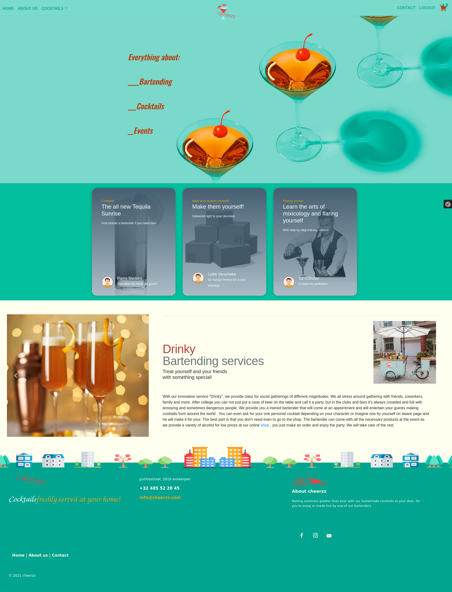
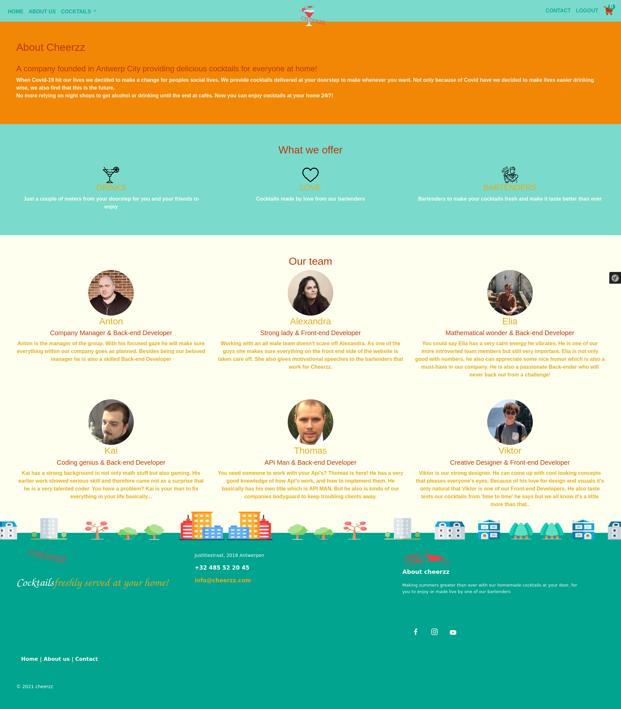

# BarThing
## Bartending services 
[home page](https://github.com/AntonKantardzhiev/BarThing/tree/main/templates/home)

### MADE BY:
    Anton Kantartzhiev
     -scrum master and some backend
    Alexandra Banica, Viktor Podevyn
     -frontend dev
    Kai Helsen, Thomas Pieters, Elia Coels
     -backend dev   

### LIBRARIES & DEPENDENCIES

This site uses:

[Bootstrap 4.6](https://getbootstrap.com/) (It's already called from the base.twig file ), 
[Symfony 5](https://symfony.com/download),
[DB](https://www.thecocktaildb.com/api.php), 
[SASS](https://sass-lang.com/), 

### Tasks

~~TODO: preview~~ done

~~TODO: Call API~~ done 

~~TODO: Make a cocktail calculation controller~~ done

~~TODO: Design concept~~ done

~~TODO: DIY cocktail~~  done

~~TODO: Pages~~ done

~~TODO: Routing~~ done

~~TODO: Shopping page~~ done

~~TODO: Training videos~~ done

~~TODO: Final functionalities~~ done

